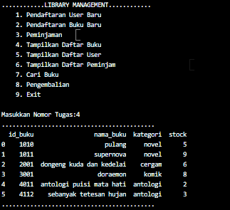

# Library Management System (LMS) Sederhana

---

**Tujuan Pengerjaan Project**

Membuat sebuah aplikasi manajemen perpustakaan sederhana yang dapat melakukan pendaftaran anggota perpustakaan, pendaftaran buku baru, peminjaman, menampilkan data anggota, buku, dan daftar peminjaman serta melakukan pencarian buku.

**Detail/deskripi task**
1. Membuat fungsi *create_server_connection*, fungsi ini membuat koneksi ke server MySQL.
2. Membuat fungsi *create_database*, fungsi tersebut digunakan untuk membuat database baru.
3. Membuat fungsi *create_connect*, fungsi ini digunakan untuk memodifikasi fungsi create_server_connection untuk terhubung langsung ke database.
4. Membuat fungsi *execute_query*, digunakan untuk mengeksekusi query.
5. Membuat fungsi *read_query*, fungsi ini berfungsi untuk membaca data dari database.
6. Membuat fungsi *main*, yang digunakan untuk menampilkan menu utama dari program.
7. Membuat fungsi *tambah_user*, fungsi ini digunakan untuk menambahkan data anggota perpustakaan ke dalam database.
8. Membuat fungsi *tambah_buku*, fungsi ini berguna untuk menambahkan data buku perpustakaan ke dalam database.
9. Membuat fungsi *pinjam_buku*, fungsi ini digunakan untuk menambahkan data peminjaman buku ke dalam database.
10. Membuat fungsi *tampil_buku* yang digunakan untuk menampilkan daftar buku yang ada di perpustakaan.
11. Membuat fungsi *tampil_user* yang digunakan untuk menampilkan daftar anggota perpustakaan.
12. Membuat fungsi *tampil_peminjam* yang digunakan untuk menampilkan data peminjaman buku.
13. Membuat fungsi *cari_buku*, fungsi ini digunakan untuk melakukan pencarian buku perpustakaan.
14. Membuat fungsi *kembali_buku*, fungsi ini digunakan untuk menghapus data peminjaman buku.

**Cara Running/Penggunaan Program**

Jalankan file main.py di jupyterLab dengan menggunakan perintah `python main.py`. Setelah itu menu utama dari program akan muncul, pilih nomor tugas sesuai kebutuhan anda.

**Hasil Test Case**
1. Pendaftaran user baru

2. Pendaftaran buku baru

3. Menampilkan data user

4. Menampilkan daftar buku

5. Peminjaman buku

6. Menampilkan daftar peminjam

7. Menampilkan daftar buku (pada bagian buku *supernova* jumlah stocknya berkurang setelah dilakukan peminjaman)

8. Menampilkan pengembalian buku

9. Menampilkan daftar buku (pada bagian buku *supernova* jumlah stocknya bertambah setelah dilakukan pengembalian)

10. Menampilkan pencarian buku

11. Keluar dari program

**Saran/Perbaikan**
1. Program dibuat lebih banyak *exception handling* untuk menghindari adanya human error saat penginputan.
2. Fungsi-fungsi yang ada pada program sebaiknya di buat pada file python yang berbeda untuk mempermudah menemukan kesalahan jika terjadi error.
3. Program alangkah baiknya di buat menggunakan konsep OOP.
